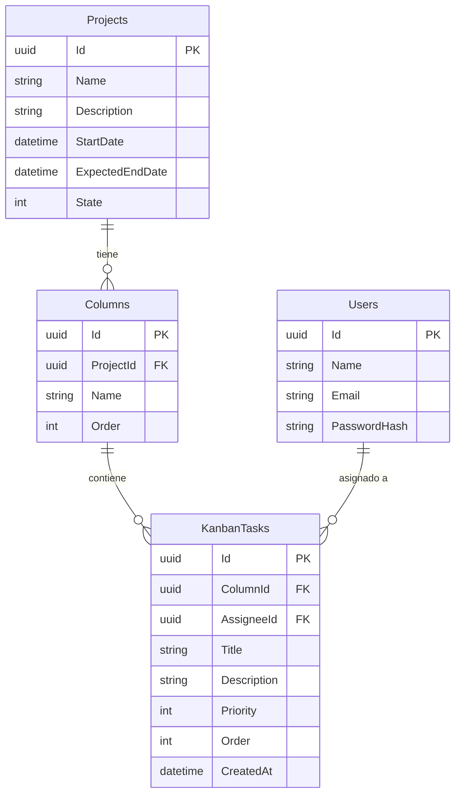

# IdeasGroup Kanban - Prueba Técnica Full Stack

Este repositorio contiene la solución a la prueba técnica de Selección para el perfil **Desarrollador Full Stack Mid Senior**. 
El aplicativo web es un tablero Kanban en tiempo real, desarrollado con **.NET 8** y **Angular 17**.

## Instrucciones de Ejecución

El proyecto está dockerizado para facilitar su levantamiento sin necesidad de instalar dependencias locales más allá de Docker.

1. Clona el repositorio.
2. Asegúrate de tener Docker y Docker Compose instalados.
3. El archivo `docker-compose.yml` ya tiene configuradas las variables de entorno necesarias (y un `.env.example` embebido en los valores por defecto del compose para agilizar la ejecución).
4. Ejecuta el siguiente comando en la raíz del repositorio:
   ```bash
   docker compose up -d --build
   ```
5. Accede al aplicativo web en `http://localhost:4200`

> **Nota:** La base de datos PostgreSQL se inicializa automáticamente y las migraciones de Entity Framework se aplican solas al arrancar el contenedor del backend. Se inyectan 2 usuarios de prueba automáticamente con contraseña pre-hasheada.

## Credenciales de Acceso (Semilla)
- **Usuario 1:** alice@ideasgroup.test / `Password123!`
- **Usuario 2:** bob@ideasgroup.test / `Password123!`

---

## 1. Decisiones Arquitectónicas

### Backend: Arquitectura Limpia / Hexagonal
Se estructuró la solución .NET en capas claramente definidas (`API`, `Application`, `Domain`, `Infrastructure`).
- **Domain:** Contiene las entidades del negocio (`User`, `Project`, `Column`, `KanbanTask`) y las abstracciones de los repositorios. No tiene dependencias externas.
- **Application:** Contiene la lógica de negocio, DTOs y servicios. Define los contratos de puertos primarios y secundarios.
- **Infrastructure:** Implementa los repositorios (Entity Framework), configuración de base de datos e inyección de servicios externos.
- **API:** Capa de presentación (Controladores REST y Hubs de SignalR).

**Justificación:** Esto garantiza una alta mantenibilidad, separación de responsabilidades y facilita las pruebas unitarias al poder *mockear* las interfaces de los repositorios.

### Frontend: Arquitectura Basada en Características (Feature-based)
La aplicación Angular se divide en `core`, `layout` y `features`.
- Se utilizó **PrimeNG** (con la plantilla Sakai) para acelerar el desarrollo de componentes visuales con aspecto profesional.
- Los componentes son `Standalone` (Angular 14+), reduciendo la necesidad de módulos engorrosos.

---

## 2. Diagrama del Modelo de Base de Datos



---

## 3. Tecnología de Tiempo Real: SignalR

Se eligió **ASP.NET Core SignalR** para la sincronización en tiempo real del tablero.

**Alternativas descartadas:**
1. **Server-Sent Events (SSE):** Descartado porque es unidireccional (Servidor a Cliente). Aunque ideal para notificaciones, SignalR encapsula de manera más robusta la reconexión, fallback a WebSockets y agrupación por grupos (Projects).
2. **WebSockets Puros:** Descartado porque requiere manejar manualmente el framing de los mensajes, ping/pongs, caídas de conexión y enrutamiento a clientes específicos. SignalR hace todo esto *out-of-the-box*.

**Implementación:**
- Se utilizó la característica de `Groups` en SignalR. Cuando un usuario entra a un proyecto, su conexión se une al grupo `Project_{Id}`. De esta manera, el servidor solo emite actualizaciones de tareas a los usuarios suscritos a ese mismo proyecto.
- Autenticación en SignalR lograda interceptando el `access_token` de la query string para inyectarlo en el pipeline de JWT del sistema.

---

## 4. Estrategia de Índices de Ordenamiento

Para resolver el problema del ordenamiento por arrastre (Drag and Drop) de las columnas y tareas, se implementó una estrategia de **"Recálculo Total del Índice (Integer Array Reordering)"**.

- Cada tarea tiene una propiedad entera estricta `Order`.
- Al mover una tarea de posición o columna, el sistema toma el ID de la tarea, el ID de la nueva columna y el índice del arreglo (`NewOrder`) en el que fue soltada por el usuario en el frontend.
- El backend (`MoveTaskAsync`) extrae todas las tareas de la columna objetivo, inserta la tarea movida en la posición exacta, e itera la lista actualizando el valor `Order` al índice de la iteración actual (0, 1, 2...).

**Justificación:** A pesar de que en bases de datos con millones de filas el recálculo masivo puede ser costoso (donde un *Lexico-graphical String Ordering* tipo JIRA hubiese sido mejor), para el dominio de un Kanban donde típicamente no hay más de 500 tareas por columna, el enfoque de índices enteros simples previene problemas matemáticos de límites numéricos (como los que se sufren dividiendo promedios flotantes) y garantiza que la columna mantenga una integridad 0..N estricta sin saltos.

---

## 5. Patrón en la Exportación Dual (Strategy Pattern)

Para cumplir con el requerimiento de que *"una sola estructura de transferencia alimente ambos formatos (PDF/Excel)"* y asegurar que *"incorporar un tercer formato no exija modificar las clases existentes"*, se implementó el **Patrón Strategy (Estrategia)** combinado con el **Patrón Factory**.

1. Interfaz `IReportStrategy` que define el método de generación sobre datos genéricos.
2. `PdfReportStrategy` (usando **QuestPDF**) y `ExcelReportStrategy` (usando **EPPlus** o **ClosedXML**) implementan esta interfaz.
3. El controlador consume `IReportFactory.CreateStrategy(format)` para decidir la estrategia a utilizar en tiempo de ejecución, pasando los mismos modelos limpios sin saber qué exportador opera.

---

## 6. Pruebas Automatizadas
El sistema incluye la batería mínima de 10 pruebas unitarias requeridas:
- **Backend (xUnit + Moq + FluentAssertions):** Ubicadas en `IdeasGroupKanban.Tests`. Prueba obligatoria de `TaskService.MoveTaskAsync` (Recálculo de la nueva posición validado matemáticamente), así como pruebas del `ProjectService`.
- **Frontend (Jasmine + Karma):** Pruebas del `ProjectService` para validación de llamadas HTTP (mock usando `HttpTestingController`) en relación a la paginación de los proyectos y las operaciones CRUD básicas.

---

## 7. Requisitos Opcionales Cumplidos
✅ Filtros del tablero por responsable y por prioridad, aplicados al tablero, a la búsqueda y a los reportes exportables.
✅ Búsqueda de tareas por texto en tiempo real (por Título o Descripción).
✅ Indicador de usuarios conectados al tablero. ¡Si varios usuarios abren el mismo proyecto, verás sus avatares superpuestos en la esquina del Kanban utilizando persistencia *in-memory* combinada con *SignalR*!

---

## 8. Declaración del uso de Asistentes de Inteligencia Artificial
Durante el desarrollo de esta prueba, se utilizó asistencia de herramientas de IA generativa para optimizar tareas repetitivas, tales como:
- Andamiaje (Scaffolding) de componentes Angular base con PrimeNG.
- Autocompletado de configuraciones rutinarias de Entity Framework en la capa de persistencia (Fluent API).
- Diseño y generación de la plantilla de los reportes PDF en QuestPDF.
- Toda lógica matemática, estructura arquitectónica y configuración de tiempo real (SignalR) fue planificada, validada y ajustada bajo mi propio criterio profesional en línea con las buenas prácticas de la industria.

¡Gracias por la oportunidad y espero tus comentarios!
